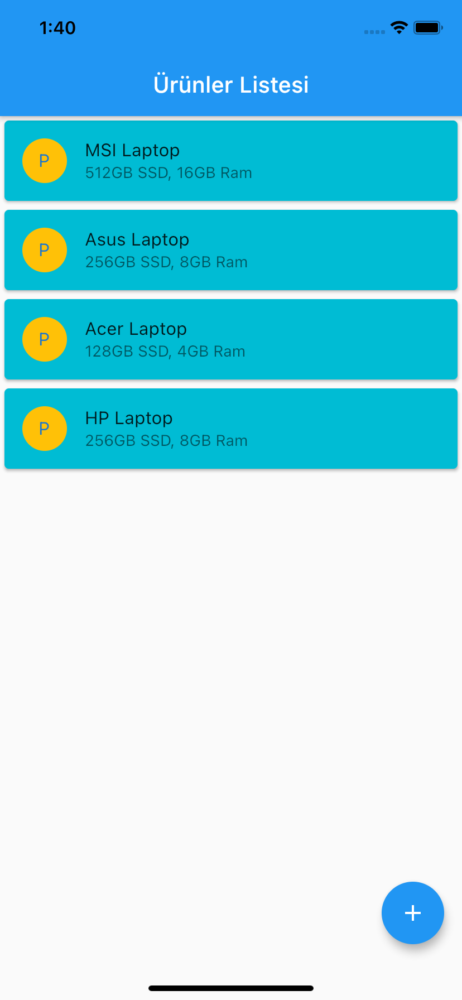
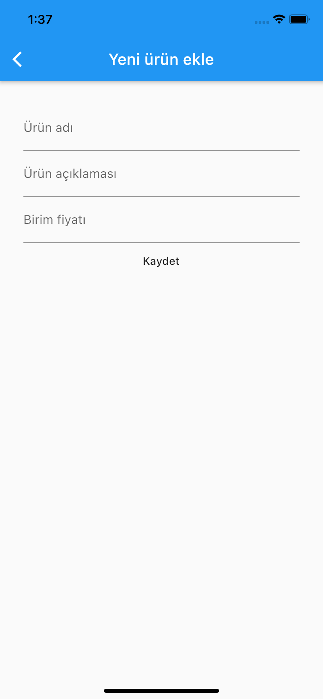
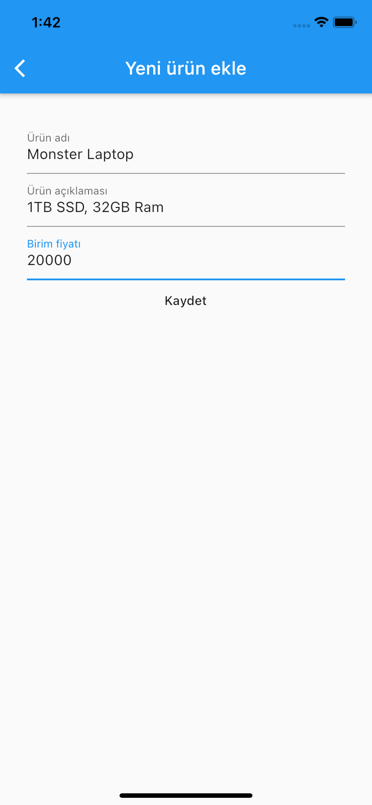

# Sqflite App

An app that creates, reads, updates and deletes data from database.

## Through this project, I've learned how to:
-	work with the Sqflite package and how to handle the database.
-   work with asynchronous structures.
-   work with CRUD operations on the project.

Screenshots of the app:

&nbsp; &nbsp; &nbsp; &nbsp; 
